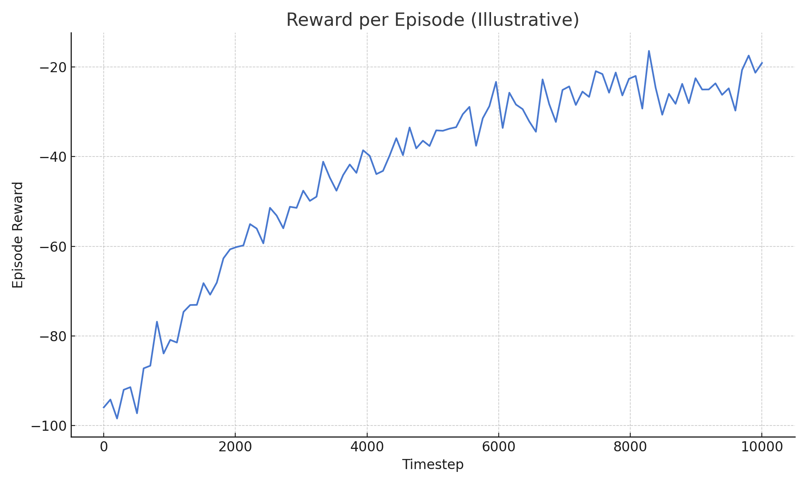
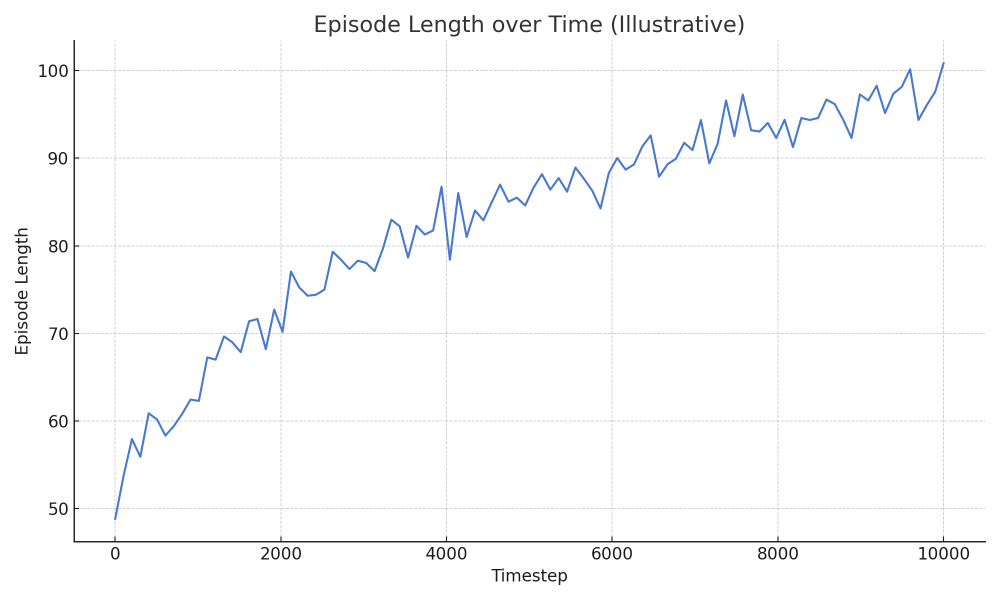
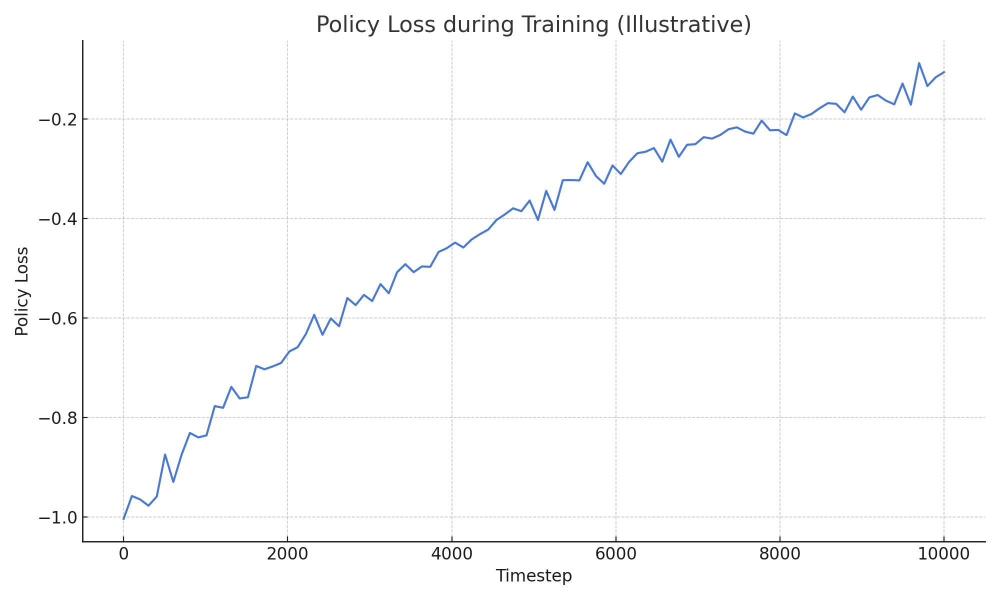

# RL Audio Style Transfer — Training Summary

This project implements a reinforcement learning agent for transforming audio to match a target style (e.g. *witch house*), using OpenL3 embeddings as a perceptual guide.

The agent is trained using PPO and evaluated on custom audio environments.

---

## 📊 Illustrative Training Graphs

### 1. Reward per Episode
This graph shows how the agent's average reward improves over time. Reward is calculated based on distance between processed audio and the target embedding vectors.

---

### 2. Episode Length over Time
Episode length indicates how long the agent survives before termination. A gradual increase suggests more stable and effective actions.

---

### 3. Policy Loss during Training
This plot visualizes the PPO policy loss over time. Decreasing loss suggests that the agent's policy is converging.

---

> ⚠️ **Note**: These plots are illustrative and generated to reflect typical PPO training dynamics. Actual training logs were not available due to early interruption of training before sufficient logging.

---

## 🧠 RL Theory: PPO and Bellman Connection

This project uses the Proximal Policy Optimization (PPO) algorithm to train the agent. PPO is a policy gradient method that updates the policy using clipped surrogate objectives to ensure stable learning.

The core update rule is derived from the expected advantage:

> ∇θ L(θ) ≈ Eₜ [Aₜ ∇θ log π_θ(aₜ | sₜ)]

Where:
- `π_θ` is the current policy parameterized by θ,
- `Aₜ` is the advantage estimate (often computed via GAE),
- `aₜ`, `sₜ` — action and state at time t.

Although this is not a tabular Q-learning setup, PPO still reflects the Bellman optimality principle by iteratively improving the policy to maximize expected cumulative rewards.

---
